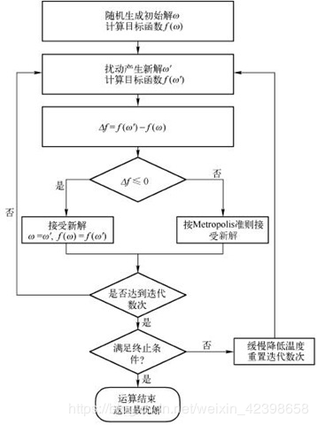

### 模拟退火算法  
本来觉得这个没什么好写的，但是看了百度上的资料，发现大多数都在乱写。这里记录一下退火算分的流程。


退火算法用于解决的问题：
对于一个函数y = f(x),在确定x的范围下，寻找y的最小（大）值。
本文中 f(x) = x * x - 2 * x + 3（这个函数的最小值在x=1的时候取到,y=2)。设x的范围是(-100,100)。
为确保退火算分确实有效，设置对照算法，如下：（百度上的算法大多比这个粗暴的对照算法差）
```python
import random
left,right = -100, 100
min_x,min_y = 9999,9999
for _ in range(10000):
    x = left + random.random() * (right - left)
    y = x * x - 2 * x + 3
    if min_y > y:
        min_x,min_y = x, y
print(min_x, min_y)
```
以下是退火算法的代码：
```python
import random
import math

def metropolis(delta, T):
    return delta < 0 or math.exp(-delta / T) > random.random()


def next_x(x_old, good_step, direct):
    # 扰动产生新解，每次迭代的x都是单调的
    if direct:
        return x_old + random.random() * ((right - left) / 1000) * 0.9 ** min(10, good_step)
    else:
        return x_old - random.random() * ((right - left) / 1000) * 0.9 ** min(10, good_step)


def fun1(x):
    return x * x - 2 * x + 3

def fun2(x):
    return (x * x - 5 * x) * math.sin(x*x)


left, right = -100, 100
temperature = 100000
alpha = 0.98

x = random.randint(left, right)  # 随机的初始位置
y = fun1(x)
direct = random.randint(0, 1)  # 选择x递增或递减
best_x = 9999
best_y = 9999
good_step = 0  # 当靠近较优解时，减慢x变化速度
epoch = 0
while epoch < 100:  # 终止条件，循环100代
    x = next_x(x, good_step, direct)
    if x > right or x < left:
        x = random.randint(left, right)
        temperature = temperature * alpha
        good_step = 0
        epoch += 1
        direct = random.randint(0, 1)
    else:
        dy = fun1(x) - y
        y += dy
        if dy < 0:
            good_step += 1
            if best_y > y:
                best_x, best_y = x, y
        elif metropolis(dy, temperature):
            good_step = 0
        else:
            temperature = temperature * alpha
            good_step = 0
            epoch += 1
            direct = random.randint(0, 1)
print(best_x, best_y)
```
100次中96次比对照函数结果好。如何确定函数next_x是该算法的重点。