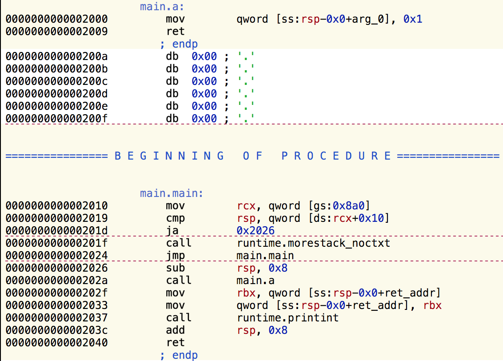
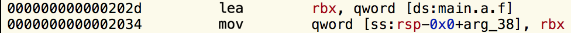
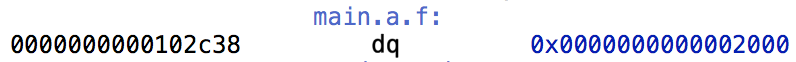
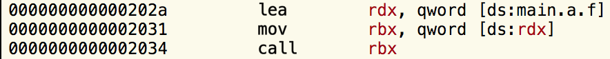

#####  [原文链接](https://bou.ke/blog/monkey-patching-in-go/)

## Go中的[猴子补丁(monkey patching)](https://www.jianshu.com/p/f1060b22aab8)

很多人认为猴子打补丁是仅限于Ruby和Python等动态语言的事情。然而，事实并非如此，因为计算机只是笨重的机器，
我们总是可以让它们做我们想做的事情 让我们来看看Go函数是如何工作的，以及我们如何在运行时修改它们。本文将
使用大量的英特尔汇编语法，所以我假设你已经能读懂它，或者在阅读时使用[参考资料](https://software.intel.com/content/www/us/en/develop/articles/introduction-to-x64-assembly.html)。

**如果你对它的工作原理不感兴趣，只是想做猴子的修补，那么你可以在[这里](https://github.com/bouk/monkey)找到这个库。**

让我们来看看下面的代码在反汇编时产生了什么。
```go
package main

func a() int { return 1 }

func main() {
  print(a())
}
```

      注: 样本应该用go build -gcflags=-l来禁用内联。在这篇文章中，我假设你的架构是64位的，而且你使用的是基于unix的操作系统，如Mac OSX或Linux的变体。

当编译并通过[Hopper](https://www.hopperapp.com/)查看时，上述代码将产生这样的汇编代码。



我将参考屏幕左侧显示的各种指令的地址。
我们的代码从程序`main.main`开始，其中指令`0x2010`至`0x2026`设置了堆栈。你可以在[这里](https://dave.cheney.net/2013/06/02/why-is-a-goroutines-stack-infinite)
阅读更多的内容，我将在文章的其余部分忽略这段代码。
第`0x202a`行是对函数`main.a`的调用，在第`0x2000`行，它只是将`0x1`移到堆栈中并返回。
第`0x202f`至`0x2037`行将该值传递给`runtime.printint`。

足够简单了,现在让我们来看看函数值是如何在Go中实现的。

### 函数值在Go中是如何工作的
考虑一下下面的代码。
```go
package main

import (
  "fmt"
  "unsafe"
)

func a() int { return 1 }

func main() {
  f := a
  fmt.Printf("0x%x\n", *(*uintptr)(unsafe.Pointer(&f)))
}
```
我在第11行所做的是将`a`分配给`f`，这意味着现在做`f()`会调用`a`。然后我使用Go中的[unsafe](https://golang.org/pkg/unsafe/)包直接读出存储在`f`中的值。
如果你有C语言背景，你可能会认为`f`只是一个指向`a`的函数指针，因此这段代码会打印出`0x2000`（即我们上面看到的`main.a`的位置）。
当我在我的机器上运行这段代码时，我得到了`0x102c38`，这是一个与我们的代码毫不相干的地址! 
当反汇编时，这就是上面第11行的情况。



这引用了一个叫`main.a.f`的东西，当我们看这个位置的时候，同时也看到了这个。



啊哈！`main.a.f`在`0x102c38`处，包含`0x2000`，也就是`main.a`的位置。看来f不是一个函数的指针，而是一个指向函数的指针。
让我们修改代码来弥补这一点。
```go
package main
 
import (
  "fmt"
  "unsafe"
)
 
func a() int { return 1 }
 
func main() {
  f := a
  fmt.Printf("0x%x\n", **(**uintptr)(unsafe.Pointer(&f)))
}
```
现在这将打印`0x2000`，正如预期的那样。我们可以在[这里](https://github.com/golang/go/blob/e9d9d0befc634f6e9f906b5ef7476fbd7ebd25e3/src/runtime/runtime2.go#L75-L78)
找到为什么要这样实现的线索。
Go函数值可以包含额外的信息，这就是闭包和绑定实例方法的实现方式。

让我们来看看调用函数值是如何工作的。我将改变代码，在赋值后调用`f`。
```go
package main

func a() int { return 1 }

func main() {
	f := a
	f()
}
```

当我们反汇编这个时，我们会得到以下结果。



`main.a.f`被加载到`rdx`中，然后不管`rdx`指向什么，都被加载到`rbx`中，然后被调用。
函数值的地址总是被加载到`rdx`中，被调用的代码可以用它来加载任何可能需要的额外信息。
这些额外的信息对于一个绑定的实例方法来说是一个指向实例的指针，对于一个匿名函数来说是一个闭包。
如果你想知道更多，我建议你拿出一个反汇编程序，深入研究一下。

让我们用我们新获得的知识来实现Go中的monkeypatching。

### 在运行时替换一个函数
我们想实现的是让下面的代码打印出"2"。
```go
package main

func a() int { return 1 }
func b() int { return 2 }

func main() {
	replace(a, b)
	print(a())
}
```
现在我们如何实现`replace`？我们需要修改函数a，使其跳转到b的代码，而不是执行自己的主体。
基本上，我们需要用这个来代替它，它将`b`的函数值加载到`rdx`中，然后跳转到`rdx`所指向的位置。
```x86asm
mov rdx, main.b.f ; 48 C7 C2 ?? ?? ?? ??
jmp [rdx] ; FF 22
```
我把这些行在汇编时产生的相应机器代码放在旁边（你可以使用像[这样](https://defuse.ca/online-x86-assembler.htm)的
在线汇编器轻松地玩转汇编）。
编写一个能生成这段代码的函数现在就很简单了，看起来像这样。
```go
func assembleJump(f func() int) []byte {
  funcVal := *(*uintptr)(unsafe.Pointer(&f))
  return []byte{
    0x48, 0xC7, 0xC2,
    byte(funcval >> 0),
    byte(funcval >> 8),
    byte(funcval >> 16),
    byte(funcval >> 24), // MOV rdx, funcVal
    0xFF, 0x22,          // JMP [rdx]
  }
}
```
我们现在已经有了用跳转到`b`的函数体来替换`a`的函数体所需要的一切! 下面的代码试图将机器代码直接复制到函数体的位置。
```go
package main

import (
	"syscall"
	"unsafe"
)

func a() int { return 1 }
func b() int { return 2 }

func rawMemoryAccess(b uintptr) []byte {
	return (*(*[0xFF]byte)(unsafe.Pointer(b)))[:]
}

func assembleJump(f func() int) []byte {
	funcVal := *(*uintptr)(unsafe.Pointer(&f))
	return []byte{
		0x48, 0xC7, 0xC2,
		byte(funcVal >> 0),
		byte(funcVal >> 8),
		byte(funcVal >> 16),
		byte(funcVal >> 24), // MOV rdx, funcVal
		0xFF, 0x22,          // JMP [rdx]
	}
}

func replace(orig, replacement func() int) {
	bytes := assembleJump(replacement)
	functionLocation := **(**uintptr)(unsafe.Pointer(&orig))
	window := rawMemoryAccess(functionLocation)
	
	copy(window, bytes)
}

func main() {
	replace(a, b)
	print(a())
}
```
然而，运行这段代码并不奏效，会导致`Segmentfault`。这是因为加载的二进制文件[在默认情况下是不可写的](https://en.wikipedia.org/wiki/Segmentation_fault#Writing_to_read-only_memory)。
我们可以使用`mprotect`系统调用来禁用这种保护，这段最终版本的代码正是这样做的，结果是函数`a`被函数`b`取代，'2'被打印。
```go
package main

import (
	"syscall"
	"unsafe"
)

func a() int { return 1 }
func b() int { return 2 }

func getPage(p uintptr) []byte {
	return (*(*[0xFFFFFF]byte)(unsafe.Pointer(p & ^uintptr(syscall.Getpagesize()-1))))[:syscall.Getpagesize()]
}

func rawMemoryAccess(b uintptr) []byte {
	return (*(*[0xFF]byte)(unsafe.Pointer(b)))[:]
}

func assembleJump(f func() int) []byte {
	funcVal := *(*uintptr)(unsafe.Pointer(&f))
	return []byte{
		0x48, 0xC7, 0xC2,
		byte(funcVal >> 0),
		byte(funcVal >> 8),
		byte(funcVal >> 16),
		byte(funcVal >> 24), // MOV rdx, funcVal
		0xFF, 0x22,          // JMP rdx
	}
}

func replace(orig, replacement func() int) {
	bytes := assembleJump(replacement)
	functionLocation := **(**uintptr)(unsafe.Pointer(&orig))
	window := rawMemoryAccess(functionLocation)
	
	page := getPage(functionLocation)
	syscall.Mprotect(page, syscall.PROT_READ|syscall.PROT_WRITE|syscall.PROT_EXEC)
	
	copy(window, bytes)
}

func main() {
	replace(a, b)
	print(a())
}
```

#### 把它包装在一个漂亮的库中
我把上面的代码放在了[一个易于使用的库中](https://github.com/bouk/monkey)。它支持32位，反转补丁，
以及修补实例方法。我写了几个例子，并把它们放在README中。

#### 结论
有志者事竟成! 一个程序有可能在运行时修改自己，这使我们能够实现像猴子打补丁这样的很酷的技巧。

我希望你能从这篇博文中得到一些有用的东西，我知道我在做这篇文章时很开心。
