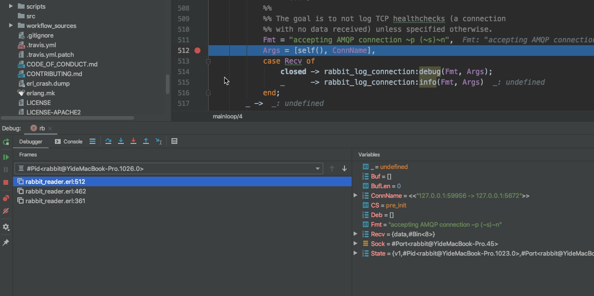

### 准备条件
- 从源码编译rabbitmq，我用的是 https://github.com/rabbitmq/rabbitmq-server/releases/tag/v3.8.14   
能搞成下面那样就说明好了，这一步网上有大量资料，这里不在介绍了
```
yimo@YideMacBook-Pro rabbitmq-server-3.8.14 % sudo ./sbin/rabbitmq-server
Password:
Configuring logger redirection

  ##  ##      RabbitMQ 2.7.0+dirty
  ##  ##
  ##########  Copyright (c) 2007-2021 VMware, Inc. or its affiliates.
  ######  ##
  ##########  Licensed under the MPL 2.0. Website: https://rabbitmq.com

  Doc guides: https://rabbitmq.com/documentation.html
  Support:    https://rabbitmq.com/contact.html
  Tutorials:  https://rabbitmq.com/getstarted.html
  Monitoring: https://rabbitmq.com/monitoring.html

  Logs: /var/log/rabbitmq/rabbit@YideMacBook-Pro.log
        /var/log/rabbitmq/rabbit@YideMacBook-Pro_upgrade.log

  Config file(s): (none)

  Starting broker... completed with 0 plugins.
```
- 下一个idea和erlang插件，官方的插件debug有很多bug，所以建议用这位兄弟的插件
https://blog.csdn.net/eeeggghit/article/details/106021723#comments_12664319
- 在rabbitmq中弄一个账号，方便之后的使用

### 开始
- 配置idea启动rabbitMQ
Project Structure-> Platform Settings-> SDKs中添加erlang的sdk
Project Structure-> Project Settings -> Project中选择erlang的sdk
Idea右上方的Run/debug Configurations中按+号，添加Erlang Application

Module 选 rabbitmq-server-3.8.14(默认应该就是这个)    
Module and function写 rabbit start（没什么用）  
Function arguments 不用写  
Working directory 写工程目录 /Users/yimo/Downloads/rabbitmq-server-3.8.14  
Flag for 'erl' 需要把deps目录下所有的ebin文件夹配置在内，非常长,下面是例子  
```
-pa 
deps/accept/ebin
deps/gun/ebin
deps/rabbitmq_auth_mechanism_ssl/ebin
deps/rabbitmq_peer_discovery_consul/ebin
deps/rabbitmq_web_dispatch/ebin
deps/amqp10_client/ebin
deps/jose/ebin
deps/rabbitmq_aws/ebin
deps/rabbitmq_peer_discovery_etcd/ebin
deps/rabbitmq_web_mqtt/ebin
deps/amqp10_common/ebin
deps/jsx/ebin
deps/rabbitmq_cli/ebin
deps/rabbitmq_peer_discovery_k8s/ebin
deps/rabbitmq_web_mqtt_examples/ebin
deps/amqp_client/ebin
deps/lager/ebin
deps/rabbitmq_codegen/ebin
deps/rabbitmq_prelaunch/ebin
deps/rabbitmq_web_stomp/ebin
deps/aten/ebin
deps/observer_cli/ebin
deps/rabbitmq_consistent_hash_exchange/ebin
deps/rabbitmq_prometheus/ebin
deps/rabbitmq_web_stomp_examples/ebin
deps/base64url/ebin
deps/prometheus/ebin
deps/rabbitmq_event_exchange/ebin
deps/rabbitmq_random_exchange/ebin
deps/ranch/ebin
deps/cowboy/ebin
deps/ra/ebin
deps/rabbitmq_federation/ebin
deps/rabbitmq_recent_history_exchange/ebin
deps/recon/ebin
deps/cowlib/ebin
deps/rabbit/ebin
deps/rabbitmq_federation_management/ebin
deps/rabbitmq_sharding/ebin
deps/stdout_formatter/ebin
deps/credentials_obfuscation/ebin
deps/rabbit_common/ebin
deps/rabbitmq_jms_topic_exchange/ebin
deps/rabbitmq_shovel/ebin
deps/syslog/ebin
deps/cuttlefish/ebin
deps/rabbitmq_amqp1_0/ebin
deps/rabbitmq_management/ebin
deps/rabbitmq_shovel_management/ebin
deps/sysmon_handler/ebin
deps/eetcd/ebin
deps/rabbitmq_auth_backend_cache/ebin
deps/rabbitmq_management_agent/ebin
deps/rabbitmq_stomp/ebin
deps/elvis_mk/ebin
deps/rabbitmq_auth_backend_http/ebin
deps/rabbitmq_mqtt/ebin
deps/rabbitmq_top/ebin
deps/gen_batch_server/ebin
deps/rabbitmq_auth_backend_ldap/ebin
deps/rabbitmq_peer_discovery_aws/ebin
deps/rabbitmq_tracing/ebin
deps/goldrush/ebin
deps/rabbitmq_auth_backend_oauth2/ebin
deps/rabbitmq_peer_discovery_common/ebin
deps/rabbitmq_trust_store/ebin
```

- 启动RabbitMq
配置完后使用debug启动，然后会出现一个REPL窗口，由于是debug模式，需要手动启动rabbit
在窗口中输入```rabbit:start().``` 这时会启动失败，但是编译rabbit.erl后再次启动`c(rabbit),rabbit:start().`就能成功，不知道是什么bug。

- 查看断点是否生效

在rabbit_reader.erl line 512加上断点  
在debug窗口中:  
```
%% 输入int:interpreted(). 可以看的被打了断点的模块
(debugger_node_1617956871349@YideMacBook-Pro)1> int:interpreted().
[rabbit_reader]
%% 输入int:all_breaks().  可以看现存的断点  
(debugger_node_1617956871349@YideMacBook-Pro)2> int:all_breaks().
[{{rabbit_reader,512},[active,enable,null,null]}]
```

- 客户端测试一下断点
```
import pika
import json

credentials = pika.PlainCredentials('admin', 'admin')
connection = pika.BlockingConnection(
    pika.ConnectionParameters(host='127.0.0.1', port=5672, virtual_host='/', credentials=credentials))
channel = connection.channel()
result = channel.queue_declare(queue='python-test')

for i in range(10):
    message = json.dumps({'OrderId': "1000%s" % i})
    channel.basic_publish(exchange='', routing_key='python-test', body=message)
    print(message)
connection.close()
```

顺利进入断点

