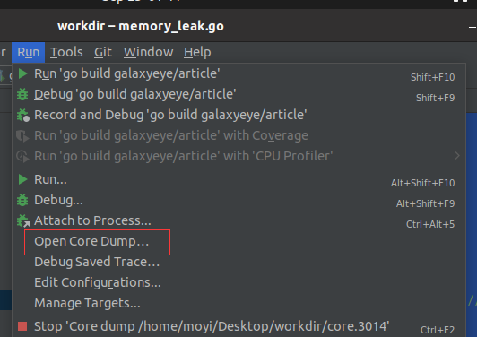
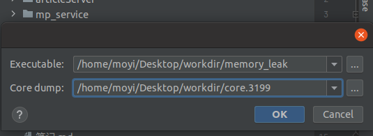
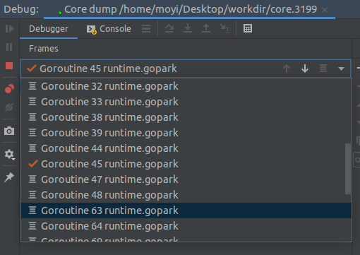
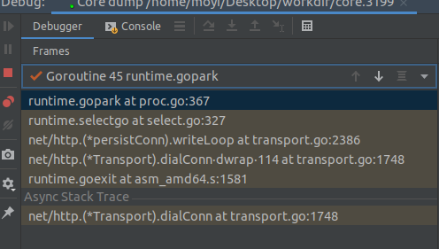

# 使用coredump解决生产环境的bug

代码上线后,偶然会出现某些bug,或者内存溢出,而测试环境却一直无法复现. 下面介绍一种比较通用的解决办法,不止是go,像c/c++,python等也可以用相似的方法

### 先来一段有内存溢出问题的代码

```go
// 文件名: memory_leak.go
import (
	"fmt"
	"net/http"
	"time"
)

func httpRequest() bool {
	_, err := http.Get("https://www.baidu.com")
	if err != nil {
		return false
	}
	return true
}

func main() {
	for {
		time.Sleep(time.Second * 5)
		fmt.Println(httpRequest())
	}
}
```

编译一下`go build memory_leak.go`得到可执行文件 `memory_leak`

这是一个比较常见go http client memory leak的问题, 造成这个问题的原因是因为没有close返回值.     
当然,对于这段代码,更多的可能是文件描述符先被使用完而不是被OOM kill.  
我们上线了这段代码后, 第二天返回值全是false,而且内存明显升高.

那么如何找出问题呢?

### debug流程

1. 找到进程对应的pid

```shell
moyi@ubuntu:~/Desktop/workdir$ ps -a | grep memory_leak
   3199 pts/3    00:00:00 memory_leak
```

2. 使用gcore生成coredump

```shell
moyi@ubuntu:~/Desktop/workdir$ sudo gcore 3199
[New LWP 3200]
[New LWP 3201]
[New LWP 3202]
[New LWP 3203]
[New LWP 3204]
warning: File "/usr/local/go/src/runtime/runtime-gdb.py" auto-loading has been declined by your `auto-load safe-path' set to "$debugdir:$datadir/auto-load".
To enable execution of this file add
        add-auto-load-safe-path /usr/local/go/src/runtime/runtime-gdb.py
line to your configuration file "/root/.gdbinit".
To completely disable this security protection add
        set auto-load safe-path /
line to your configuration file "/root/.gdbinit".
For more information about this security protection see the
"Auto-loading safe path" section in the GDB manual.  E.g., run from the shell:
        info "(gdb)Auto-loading safe path"
[Thread debugging using libthread_db enabled]
Using host libthread_db library "/lib/x86_64-linux-gnu/libthread_db.so.1".
0x0000000000464e83 in runtime.futex.abi0 ()
warning: Memory read failed for corefile section, 4096 bytes at 0xffffffffff600000.
Saved corefile core.3199
[Inferior 1 (process 3199) detached]
```

3. 使用goland恢复coredump  
   
   

4. 查看进程内的情况 发现大量与net.http有关的goroutine未被释放  
   
   


除了goland也可以使用dlv,或者pprof等工具来查看coredump.
使用gcore时,会暂停这个进程,比较安全的方式是先把要coredump的节点下线,生成完再上线,保证生产环境的安全.
